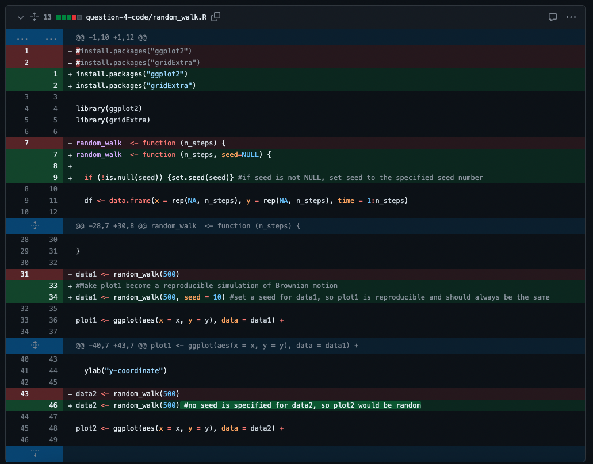

# Reproducible research: version control and R

## My Answers
### Question1-3
https://github.com/chuying02/logistic_growth

### Question 4
- Observation: the code generates two plots with different walking paths, each containing 500 steps. The colour gradient indicate the progress of each random walk, which allows us to follow the trajectory of each walk. Both walks start from the origin (0,0) on the 2-dimensional plot and meandor randomly across the 2D space, without any clear direction or pattern. The walking paths generated are random and completely different from each other. 
- A random seed is a number that initializes the process of random number generation by a pseudo random number generator (PRNG). A PRNG is a computer algorithm that generates sequences of random numbers to approximate true randomness. Computer algorithms require seed because they are not turly random -- they operate on a set of rules set by human. The seed acts as a starting place for the algorithm to apply the rules and produce a pseudo random number. As the seed determines the starting state of the PRNG, it affects the series of numbers generated by the algorithm. In other words, a PRNG will always give the same sequence of random numbers when given the same seed. The use of random seeds allows reproducibility in processes such as simulations. By setting the same seed, we can ensure that the same peudorandom sequence of numbers is produced when we run the program multiple times. If the seed is not specified by the user, the algorithm is likely to use a seed that is derived from a changing source (such as seconds on a computer system's clock), which ensures that different sequences of numbers are generated by different runs.

  Reference: Godoy, D. (2022). Random Seeds and Reproducibility. [online] Medium. Available at: https://towardsdatascience.com/random-seeds-and-reproducibility-933da79446e3
- Creating a reproducible simulation of Brownian motion (in this case, plot1 is reproducible while plot2 is random)


### Question 5
1. The data table contains 33 rows and 13 columns.
2. We can apply logarithmic transformation to both parameters (virion volume and genome length), so that the allometric equation will be transformed into a linear expression:
 $$log(V) = log(\beta) + \alpha \cdot log(L)$$
3. According to the transformation, $\alpha = 1.515$ (p = $2.28 \times 10^{-10}$, statistically significant) while $\beta = 1181.807$ (p = $6.44 \times 10^{-10}$, statistically significant). The values I got for $\alpha$ and $\beta$ are the same to those given by the "dsDNA" group in Table 2 of the paper.
4. The code that I have used to reproduce the figure is the following:
```
install.packages("ggplot2")
library(ggplot2)
data <- read.csv("question-5-data/Cui_etal2014.csv")

# logistic transformation
log_genome_length <- log(data$Genome.length..kb.)
log_virion_volume <- log(data$Virion.volume..nm.nm.nm.)

# plotting
ggplot(data, aes(x = log_genome_length, y = log_virion_volume)) +
  geom_point() + #scatter plot with data points
  geom_smooth(method = "lm", se = TRUE) +  #draw a linear regression line with the confidence interval
  labs(x = "log [Genome Length (kb)]", y = "log [Virion Volume (nm3)]") +
  theme_bw()
```
5. The estimated volume of a 300kb dsDNA virus is $6698076nm^3$

### Bonus question -- reproducibility vs. replicability
Reproducibility refers to the case where the same set of experimental results is obtained using the same data and analytic methods. It indicates that the results are consistent when different people work on the same set of data with the same method. Reproducibility allows people to check previous work published by researchers simply by using the same set of methods and analytic tools to process their published data. In contrast, replicability refers to the case where different research groups, using independent study designs (methods) and data, can come to the same conclusions. It indicates consistency in the scientific findings, which can be obtained through different approaches. 

Git is a version control tool that maintains a history of all changes applied to the code. This historical record enhances reproducibility, as people can review historical modifications made to the analysis and revert to any previous version whenever appropriate. GitHub is a platform that integrates Git and allows people to collaborate more easily. People can upload and share their code and scripts on GitHub, and the transparency allows their works to be reproduced by others. Enhanced transparency and accessibility in science improve the reliability of code and data, hence improving reproducibility and replicability of scientific research.

However, Git and GitHub do possess limitations. Although they ensure transparency in the code, they do not cover other aspects of reproducible research such as experimental design, data collection methods, as well as data interpretations. Therefore, they are primarily used for handling digital data rather than keeping track of laboratory experiments. In addition, they do not keep a record of changes in the computational environment such as software versions, which are also important for reproducing the same results. Lastly, accessibility of data may bring privacy concerns as some confidential metadata may not be appropriate to be shared with the public. Therefore, data access and confidentiality need to be managed carefully.

References:
National Academies of Sciences, E. (2019). *Reproducibility and replicability in science*. National Academies Press.


## Instructions

The homework for this Computer skills practical is divided into 5 questions for a total of 100 points (plus an optional bonus question worth 10 extra points). First, fork this repo and make sure your fork is made **Public** for marking. Answers should be added to the # INSERT ANSWERS HERE # section above in the **README.md** file of your forked repository.

Questions 1, 2 and 3 should be answered in the **README.md** file of the `logistic_growth` repo that you forked during the practical. To answer those questions here, simply include a link to your logistic_growth repo.

**Submission**: Please submit a single **PDF** file with your candidate number (and no other identifying information), and a link to your fork of the `reproducible-research_homework` repo with the completed answers. All answers should be on the `main` branch.

## Assignment questions 

1) (**10 points**) Annotate the **README.md** file in your `logistic_growth` repo with more detailed information about the analysis. Add a section on the results and include the estimates for $N_0$, $r$ and $K$ (mention which *.csv file you used).
   
2) (**10 points**) Use your estimates of $N_0$ and $r$ to calculate the population size at $t$ = 4980 min, assuming that the population grows exponentially. How does it compare to the population size predicted under logistic growth? 

3) (**20 points**) Add an R script to your repository that makes a graph comparing the exponential and logistic growth curves (using the same parameter estimates you found). Upload this graph to your repo and include it in the **README.md** file so it can be viewed in the repo homepage.
   
4) (**30 points**) Sometimes we are interested in modelling a process that involves randomness. A good example is Brownian motion. We will explore how to simulate a random process in a way that it is reproducible:

   - A script for simulating a random_walk is provided in the `question-4-code` folder of this repo. Execute the code to produce the paths of two random walks. What do you observe? (10 points)
   - Investigate the term **random seeds**. What is a random seed and how does it work? (5 points)
   - Edit the script to make a reproducible simulation of Brownian motion. Commit the file and push it to your forked `reproducible-research_homework` repo. (10 points)
   - Go to your commit history and click on the latest commit. Show the edit you made to the code in the comparison view (add this image to the **README.md** of the fork). (5 points)

5) (**30 points**) In 2014, Cui, Schlub and Holmes published an article in the *Journal of Virology* (doi: https://doi.org/10.1128/jvi.00362-14) showing that the size of viral particles, more specifically their volume, could be predicted from their genome size (length). They found that this relationship can be modelled using an allometric equation of the form **$`V = \beta L^{\alpha}`$**, where $`V`$ is the virion volume in nm<sup>3</sup> and $`L`$ is the genome length in nucleotides.

   - Import the data for double-stranded DNA (dsDNA) viruses taken from the Supplementary Materials of the original paper into Posit Cloud (the csv file is in the `question-5-data` folder). How many rows and columns does the table have? (3 points)
   - What transformation can you use to fit a linear model to the data? Apply the transformation. (3 points)
   - Find the exponent ($\alpha$) and scaling factor ($\beta$) of the allometric law for dsDNA viruses and write the p-values from the model you obtained, are they statistically significant? Compare the values you found to those shown in **Table 2** of the paper, did you find the same values? (10 points)
   - Write the code to reproduce the figure shown below. (10 points)

  <p align="center">
     
  </p>

  - What is the estimated volume of a 300 kb dsDNA virus? (4 points)

**Bonus** (**10 points**) Explain the difference between reproducibility and replicability in scientific research. How can git and GitHub be used to enhance the reproducibility and replicability of your work? what limitations do they have? (e.g. check the platform [protocols.io](https://www.protocols.io/)).
